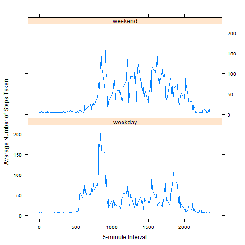

#Reproducible Research: Peer Assessment 1

This assignment makes use of data from a personal activity monitoring device. This device collects data at 
5 minute intervals through out the day. The data consists of two months of data from an anonymous individual 
collected during the months of October and November, 2012 and include the number of steps taken in 5 minute 
intervals each day.

##Data

The data for this assignment can be downloaded from the course web site:

   Dataset: [Activity monitoring data 52K](https://d396qusza40orc.cloudfront.net/repdata%2Fdata%2Factivity.zip)

The variables included in this dataset are:

   -**steps**: Number of steps taking in a 5-minute interval (missing values are coded as NA)

   -**date**: The date on which the measurement was taken in YYYY-MM-DD format

   -**interval**: Identifier for the 5-minute interval in which measurement was taken

The dataset is stored in a comma-separated-value (CSV) file and there are a total of 17,568 observations
in this dataset.

##Assignment

You will need to write a report that answers the questions detailed below. Ultimately, you will need to 
complete the entire assignment in a single R markdown document that can be processed by knitr and be 
transformed into an HTML file.

##Loading and preprocessing the data

The first step is to read the unziped file located in your current working directory:


```r
#Reads file
amd <- read.csv("activity.csv", header = TRUE, sep = ",")
#Tranforms the date column to date.The default format is yyyy-mm-dd.
amd$date = as.Date(amd$date)
```


##Questions

##1. What is mean total number of steps taken per day?
For this part of the assignment, you can ignore the missing values in the dataset.

-Calculate the total number of steps taken per day


```r
#Aggregates steps by date
aggabddata <- aggregate(amd$steps, by= list(date=amd$date), FUN=sum, na.rm=TRUE)

##Renames the second column in aggregated dataset
names(aggabddata)[2] <- "totalsteps"
```


-If you do not understand the difference between a histogram and a barplot, research the difference between 
 them. Make a histogram of the total number of steps taken each day


```r
#Displays histogram
hist(aggabddata$totalsteps, col="green", main="Total Number of Steps Taken Each Day", xlab="Total Number of Steps", ylab="Number of Days")
```

 

-Calculate and report the mean and median of the total number of steps taken per day

Mean total number of steps taken per day:


```r
mean(aggabddata$totalsteps, na.rm=TRUE)
```

```
## [1] 9354.23
```


Median total number of steps taken per day:


```r
median(aggabddata$totalsteps, na.rm=TRUE)
```

```
## [1] 10395
```


##2. What is the average daily activity pattern?

-Make a time series plot (i.e. type = "l") of the 5-minute interval (x-axis) and the average number of steps 
 taken, averaged across all days (y-axis)


```r
#Aggregates steps by interval
aggabidata <- aggregate(amd$steps, by= list(interval=amd$interval), FUN=mean, na.rm=TRUE)

##Renames the second column in aggregated dataset
names(aggabidata)[2] <- "totalsteps"

#Displays the plot
plot(aggabidata$interval, aggabidata$totalsteps,type="l",xlab="5-minute Interval", ylab="Average Number of Steps Taken", main="Average Number of Steps Taken Across All Days ")
```

 


-Which 5-minute interval, on average across all the days in the dataset, contains the maximum number of steps?

Interval with the maximum number of steps:


```r
aggabidata[which.max(aggabidata$totalsteps), ]
```

```
##     interval totalsteps
## 104      835   206.1698
```
The 835th interval contains the maximum number of steps.

##3. Imputing missing values

Note that there are a number of days/intervals where there are missing values (coded as NA). The presence of missing 
days may introduce bias into some calculations or summaries of the data.

-Calculate and report the total number of missing values in the dataset (i.e. the total number of rows with NAs)

Number of missing data:
 

```r
sum(is.na(amd))
```

```
## [1] 2304
```
Total 2304 rows are missing.

-Devise a strategy for filling in all of the missing values in the dataset. The strategy does not need to be 
 sophisticated. For example, you could use the mean/median for that day, or the mean for that 5-minute interval, etc.

**Strategy**: the missing values (NA) are replaced with the mean of steps excluding NA values. The mean(amd$steps, na.rm = T) is equal to 37.3826 so 
the missing values are replaced with this amount.

-Create a new dataset that is equal to the original dataset but with the missing data filled in.


```r
amdfilledna <- amd
amdfilledna$steps[is.na(amdfilledna$steps)] <- mean(amdfilledna$steps, na.rm = T)
```


-Make a histogram of the total number of steps taken each day 
  

```r
#Aggregates new dataset by date, returning the sum of steps
aggafnadata <- aggregate(amdfilledna$steps, by= list(date=amdfilledna$date), FUN=sum, na.rm=TRUE)

#Renames the second column in aggregated dataset
names(aggafnadata)[2] <- "totalsteps"

#Displays histogram of the total number of steps taken each day with new dataset (original dataset but with the missing data filled in)
hist(aggafnadata$totalsteps, col="red", main="Total Number of Steps Taken Each Day", xlab="Total Number of Steps", ylab="Number of Days")
```

 

-Calculate and report the mean and median total number of steps taken per day. Do these values differ from the estimates from the first part of the assignment?

Mean total number of steps taken per day (missing replaced with the mean of steps excluding NA values):


```r
mean(aggafnadata$totalsteps, na.rm=TRUE)
```

```
## [1] 10766.19
```

Median total number of steps taken per day (missing replaced with the mean of steps excluding NA values):


```r
median(aggafnadata$totalsteps, na.rm=TRUE)
```

```
## [1] 10766.19
```

-What is the impact of imputing missing data on the estimates of the total daily number of steps?

These values differ from the estimates from the first part of the assignment and the impact of imputing missing data on the estimates 
of the total daily number of steps is that the median shifted closer to the mean (in this case exactly to) the overall mean.

##4. Are there differences in activity patterns between weekdays and weekends?
For this part the weekdays() function may be of some help here. Use the dataset with the filled-in missing values for this part.

-Create a new factor variable in the dataset with two levels: weekday and weekend indicating whether a given date is a weekday or weekend day.


```r
#Tranforms the date column to date.The default format is yyyy-mm-dd.
amdfilledna$date = as.Date(amdfilledna$date)

#Creates a factor variable with two levels (weekday, weekend-day)
amdfilledna$dayofweek <- as.factor(ifelse(weekdays(amdfilledna$date) %in% c("Saturday", "Sunday"), "weekend", "weekday"))
```

-Make a panel plot containing a time series plot (i.e. type = "l") of the 5-minute interval (x-axis) and the average number of steps 
 taken, averaged across all weekday days or weekend days (y-axis). 


```r
# Calculates the mean
aggafnaweekdays <- aggregate(amdfilledna$steps, by= list(amdfilledna$interval, amdfilledna$dayofweek), FUN=mean, na.rm=TRUE)

#Renames the columns in the aggregated dataset
names(aggafnaweekdays)[1] <- "interval"
names(aggafnaweekdays)[2] <- "dayofweek"
names(aggafnaweekdays)[3] <- "totalsteps"

library(lattice)
# Displays the two plots
xyplot(totalsteps ~ interval | dayofweek, data = aggafnaweekdays, type = "l", xlab = "5-minute Interval", 
    ylab = "Average Number of Steps Taken", layout = c(1, 2))
```

 

